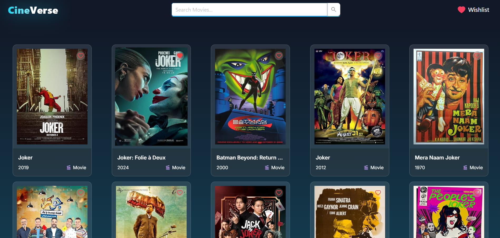
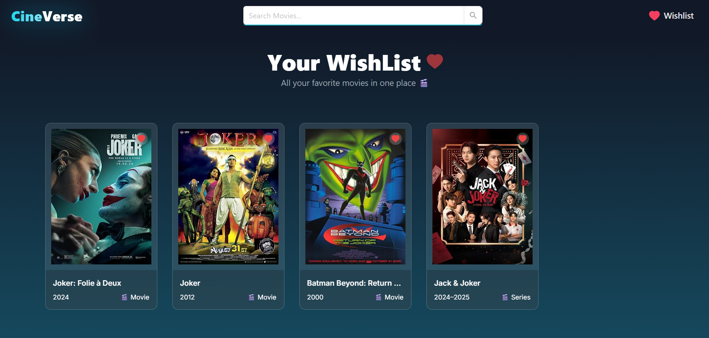

# Getting Started with Create React App

# CineVerse – Movie Rating Web Application

CineVerse is a movie discovery and rating web application that allows users to search for movies, view detailed information, and maintain a personal wishlist. The application delivers a clean and responsive interface built with modern frontend technologies.

# Live Demo

Deployed Application:
https://cineversemovies-sigma.vercel.app/

# Tech Stack

-> Create React App

-> Tailwind CSS

-> React Query (for data fetching and caching)

-> Redux Toolkit (for wishlist state management)

# Features
-> Home Section

Displays a curated list of movies with an intuitive layout and smooth navigation.

-> Search Bar

Users can search for movies by name. Search results update efficiently using React Query.

-> Wishlist

Users can add or remove movies from their wishlist by clicking the heart icon.
Wishlist state is managed using Redux Toolkit and persisted through localStorage.

-> Detailed Movie Page

Each movie has a dedicated detail page displaying information such as description, ratings, release date, cast, and posters.

# Installation and Setup

Follow the steps below to run this project locally:
```
npm install
npm start
```


# The development server will start on:
http://localhost:3000/

Project Structure Overview

```
src/
│── components/
│── pages/
│── redux/
│── hooks/
│── styles/
│── App.js
│── index.js
```

# Project Images

()




# Conclusion

CineVerse was developed as an IMDb-style movie rating and wishlist application focusing on clean UI design, smooth interactions, and efficient state management. Redux Toolkit ensures predictable global state handling for the wishlist, while React Query provides optimized data fetching and caching for movie data.